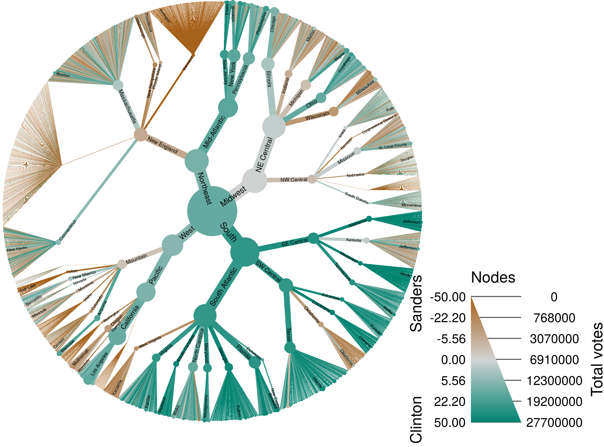
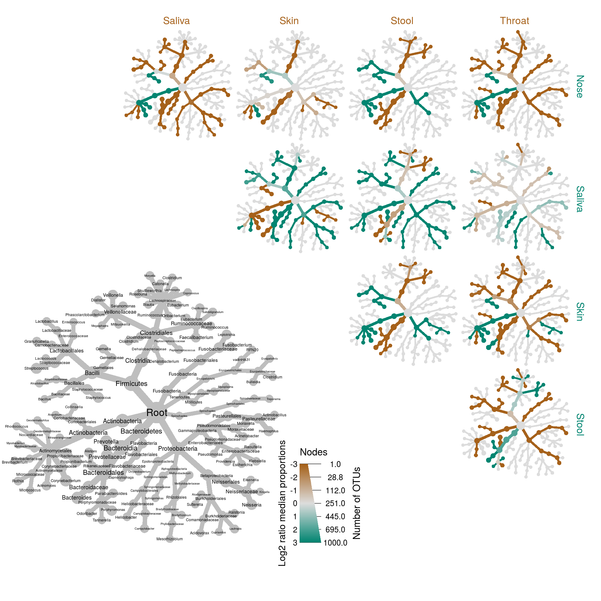

---
output:
  html_document: default
---

```{r echo=FALSE}
options(crayon.enabled = TRUE, tibble.max_extra_cols = 10)

library(knitr)
opts_chunk$set(echo = TRUE, warning = FALSE, message = FALSE, autodep = TRUE,
               dev = 'png', fig.width = 10, fig.height = 10,
               cache.lazy = FALSE, fig.align = "center")
knit_hooks$set(
  hide_button = function(before, options, envir) {
    if (is.character(options$hide_button)) {
      button_text = options$hide_button
    } else {
      button_text = "Show solution"
    }
    block_label <- paste0("hide_button", options$label)
    if (before) {
      return(paste0(sep = "\n",
                    '<button class="btn btn-danger" data-toggle="collapse" data-target="#', block_label, '"> ', button_text, ' </button>\n',
                    '<div id="', block_label, '" class="collapse">\n'))
    } else {
      return("</div><br />\n")
    }
  },
  output = function(x, options){
    x <- gsub(x, pattern = "<", replacement = "&lt;")
    x <- gsub(x, pattern = ">", replacement = "&gt;")
    paste0(
      "<pre class=\"r-output\"><code>",
      fansi::sgr_to_html(x = x, warn = TRUE, term.cap = "256"),
      # ansistrings::ansi_to_html(text = x, fullpage = FALSE),
      "</code></pre>"
    )
  }
)
options(width = 100)
```


# GBIF biodiversity example

This short example shows how the packages `rgbif`, `taxa`, and `metacoder` can be used to retrieve biodiversity data, filter it by taxonomic characteristics, and visualize it.
Each of these packages do much more than this; see the links at the end of this example for more information.


###Install packages

```{r eval=FALSE}
install.packages("metacoder")
install.packages("rgbif")
```


###Load packages

```{r message=FALSE}
library(rgbif)
library(metacoder)
```


###Geting biodiversity data

We can use the `rgbif` package to get a table of recorded plant occurrences in Oregon from the Global Biodiversity Information Facility (GBIF).
Each row is a record of a plant being observed.

```{r cache=TRUE}
occ <- occ_data(stateProvince = "Oregon", scientificName ="Plantae")
occ$data
```


###Converting to the `taxmap` format

Note how the taxonomy is encoded in a set of columns:

```{r}
colnames(occ$data)[26:31]
```

We can use these columns to infer a taxonomy and organize the data according to it.
The function `parse_tax_data` from the `taxa` package can convert data that includes a taxonomy into the `taxmap` format.

```{r}
obj <- parse_tax_data(occ$data, class_cols = 26:31, named_by_rank = TRUE)
obj
```

Note how the original table is now part of the object and a unique taxon ID has been added to each row.


### Plotting and filtering taxonomic data

Using the `taxmap` format keeps the taxonomic and non-taxonomic in sync, allowing for filtering data based on taxon characteristics and vice versa.
It also allows you to use the `heat_tree` function from the `metacoder` package to plot per-taxon data.
In the example below, we plot the number of occurrence for each taxon after filtering out species, any taxa not a subtaxa of Tracheophyta (vascular plants), and any order that does not have at least 10 subtaxa.

```{r}
obj %>% 
  filter_taxa(taxon_ranks != "species") %>% 
  filter_taxa(taxon_names == "Tracheophyta", subtaxa = TRUE) %>%
  filter_taxa(taxon_ranks == "order", n_subtaxa > 10, subtaxa = TRUE, supertaxa = TRUE) %>% 
  heat_tree(node_label = taxon_names,
            node_color = n_obs,
            node_size = n_obs,
            node_color_axis_label = "# occurrences")
```

### Other examples

#### Voting organized by geography

Any hierarchical data can be used with `metacoder` and `taxa`.
Here is an example of plotting voting results from the 2016 US Democratic primary between Bernie Sanders and Hillary Clinton, using geography as the hierarchy instead of taxonomy.

[Link to analysis code](voting_example.html)




#### Differential taxon abundance in the human microbiome

The `metacoder` package focuses on ecological analysis of taxonomic data, especially microbiome data.
Here is an example that uses `metacoder` to visualize differences in the human microbiome among body sites.

[Link to analysis code](https://grunwaldlab.github.io/metacoder_documentation/example.html)



The grey tree on the lower left functions as a key for the unlabeled trees. Each of the smaller trees represent a comparison between body sites in the columns and rows. A taxon colored brown is more abundant in the body site in the column and a taxon colored green is more abundant in body site of the row. For example, Bacteroidetes is more abundant (i.e. has more reads) in the throat samples than the nose samples and this is due to the greater abundance of two genera Prevotella and Porphyromonas.


#### Links for more information

* [metacoder documentation](https://grunwaldlab.github.io/metacoder_documentation/)
* [metacoder publication](https://journals.plos.org/ploscompbiol/article?id=10.1371/journal.pcbi.1005404)
* [taxa documentation](https://github.com/ropensci/taxa#taxa)
* [taxa publication](https://f1000research.com/articles/7-272/v2)
* [rgbif tutorial](https://ropensci.org/tutorials/rgbif_tutorial/)

  